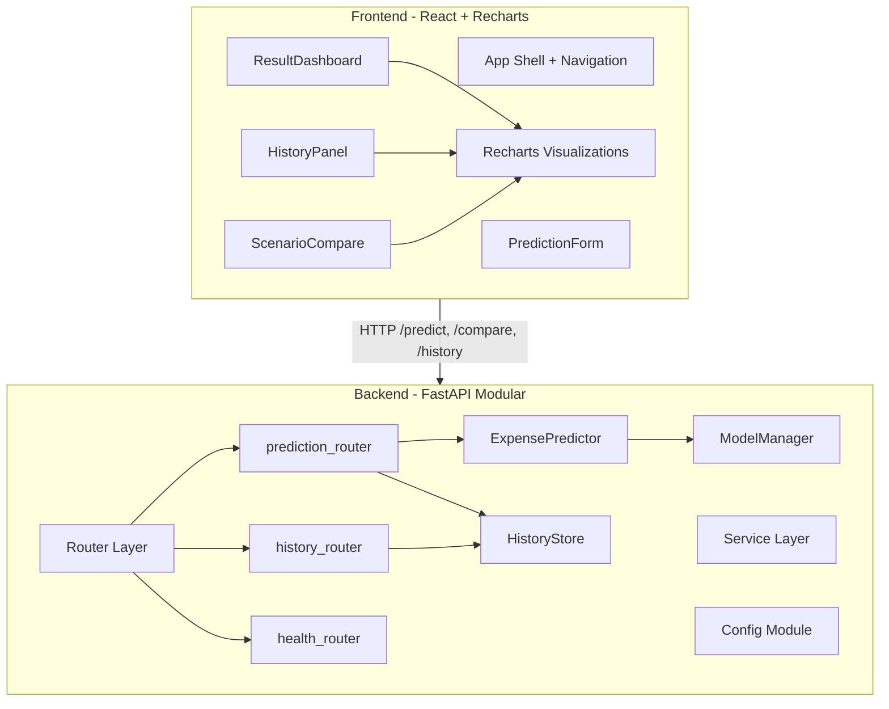

# Aura AI Financial Engine — Complete Makeover Plan

## Architecture Overview (Target State)



---

## Phase 1: Backend Restructuring

### 1A. Add Config Module — new file `backend/app/config.py`
- Extract all magic values (CORS origins, model path, DB path, dataset path) into a single config class
- Use `pydantic-settings` or plain constants — removes the hardcoded `/Users/spartan/Downloads/...` path
- Environment-variable driven for portability

### 1B. Modular Router Layer — split [backend/app/main.py](backend/app/main.py)
- Create `backend/app/routers/` directory with:
  - `prediction.py` — `/predict` and `/compare` endpoints
  - `history.py` — `/history` endpoint
  - `health.py` — `/health` and `/dataset/sample` endpoints
- `main.py` becomes a thin app factory: creates FastAPI, adds middleware, includes routers
- Follows **Single Responsibility Principle** and FastAPI best practices

### 1C. Clean Up Service Layer
- **[backend/app/services/predictor.py](backend/app/services/predictor.py):** Remove dead `ModelWeights` dataclass (unused since ML model). Tighten the class to prediction + recommendations only.
- **[backend/app/services/ml_model.py](backend/app/services/ml_model.py):** Split into two concerns:
  - `ml_model.py` — model loading, inference, contribution extraction (runtime)
  - `training.py` — dataset parsing, augmentation, training pipeline (offline only)
  - This follows **SRP** — runtime code doesn't carry training dependencies
- **[backend/app/services/history_store.py](backend/app/services/history_store.py):** Clean up the legacy schema patching into a dedicated migration/compat helper, reduce nesting

### 1D. Add Structured Logging
- Add Python `logging` with a configured format in config
- Log prediction requests, model load events, and errors — invaluable for the demo

### 1E. Enhance Tests — [backend/tests/test_api.py](backend/tests/test_api.py)
- Add edge-case tests (zero income, max credit score, boundary values)
- Add a test for the training pipeline
- Add a test that validates schema contract evolution
- Use `pytest` fixtures for test client to follow DRY

### 1F. Fix Docker Compose — [docker-compose.yml](docker-compose.yml)
- Fix conflicting volume mounts (`./backend:/app` vs `aura_history_data:/app` both target `/app`)
- Mount DB volume to a specific subdirectory

---

## Phase 2: Frontend Component Decomposition

### 2A. Break up [frontend/src/App.jsx](frontend/src/App.jsx) (564 lines) into modular components

Target structure:
```
frontend/src/
  components/
    Header.jsx              — hero banner + badges
    PredictionForm.jsx      — form inputs, presets, submit
    ResultDashboard.jsx     — stat tiles, risk meter, recommendations
    ExpenseBreakdownChart.jsx — Recharts donut + bar for expense breakdown
    BudgetPlanCard.jsx      — suggested budget as visual comparison
    ScenarioCompare.jsx     — side-by-side scenario form + visual delta
    HistoryPanel.jsx        — history table + trend line chart
    ModelExplainer.jsx      — formula panel + coefficient interpretation
  hooks/
    usePrediction.js        — prediction API call + state
    useCompare.js           — compare API call + state
    useHistory.js           — history API call + state
  utils/
    formatters.js           — formatCurrency, formatCoef, signedCoef (DRY)
  App.jsx                   — thin shell composing components
  api.js                    — kept as-is (already clean)
  main.jsx                  — kept as-is
```

Each component is a focused, testable unit. Custom hooks extract async logic from components (Separation of Concerns).

### 2B. Install Recharts for Professional Visualizations
- Add `recharts` dependency — lightweight, React-native, great for financial data
- **No other heavy dependencies** — keeps bundle small for interview demo

---

## Phase 3: UI/UX Overhaul + Visualizations

### 3A. New Visualizations (the biggest visual impact)

| Location | Current | Target |
|---|---|---|
| Expense Breakdown | Plain text list | **Recharts PieChart** (donut) showing rent/food/transport/entertainment proportions |
| Budget Plan | HTML table | **Recharts BarChart** — grouped bars: current spend vs suggested spend per category |
| Scenario Compare | 3 text paragraphs | **Side-by-side RadarChart** or grouped bar chart with visual delta indicators |
| History Trend | CSS div bars with tooltip | **Recharts AreaChart** — smooth expense trend line with savings area overlay |
| Risk Meter | CSS progress bar | **Animated gauge** with gradient segments (LOW/MED/HIGH zones marked) |

### 3B. UI Polish
- **Tabbed navigation** — instead of a long scroll, use tabs: "Predict" | "Compare" | "History" — better for a 10-min demo flow
- **Animated number transitions** on stat tiles when results arrive
- **Loading skeletons** instead of bare "Predicting..." text
- **Color-coded stat tiles** — green for savings on track, red/amber for behind goal
- **Glass-morphism cards** with subtle backdrop-filter for modern SaaS feel
- **Micro-interactions** — button hover effects, card entrance animations via CSS transitions
- **Better typography hierarchy** — larger stat numbers, smaller labels, consistent spacing

### 3C. Restyle [frontend/src/styles.css](frontend/src/styles.css)
- CSS custom properties (variables) for theming consistency
- Refined color palette with semantic tokens (success, warning, danger, info)
- Smoother transitions and hover states
- Better responsive breakpoints

---

## Phase 4: Final Polish

### 4A. Clean Comments Audit (all files)
- Remove any verbose/narrating comments
- Add brief docstrings to public Python functions explaining *why*, not *what*
- Frontend: zero comments in JSX (self-documenting component names)

### 4B. Update README
- Update architecture section to reflect new modular structure
- Add a "Demo Walkthrough" section for the 10-min presentation flow

### 4C. Validate
- Run `pytest` to confirm all tests pass
- Run `npm run build` to confirm frontend builds cleanly
- Check for linter errors in all edited files

---

## Design Principles Applied

- **SOLID**: Single Responsibility (routers, services, components), Open/Closed (config-driven behavior), Dependency Inversion (predictor depends on abstract model interface)
- **DRY**: Shared formatters, custom hooks, config module, pytest fixtures
- **Separation of Concerns**: API routing vs business logic vs ML inference vs data persistence
- **Component Composition**: Small, focused React components over monolithic files
